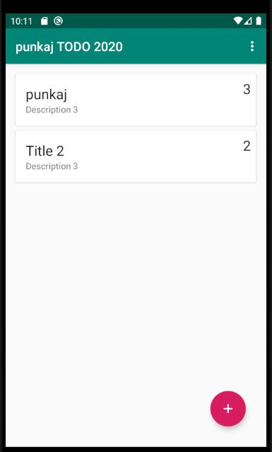
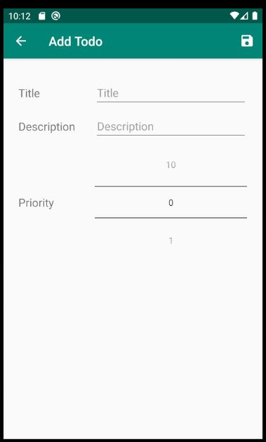
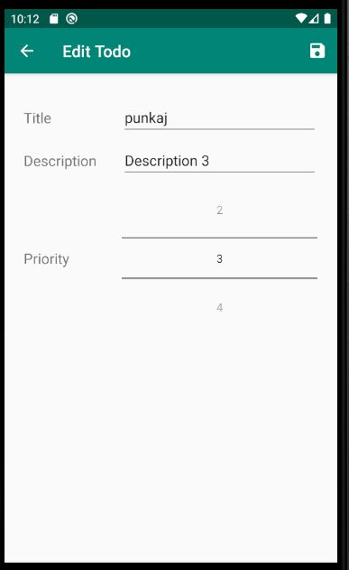
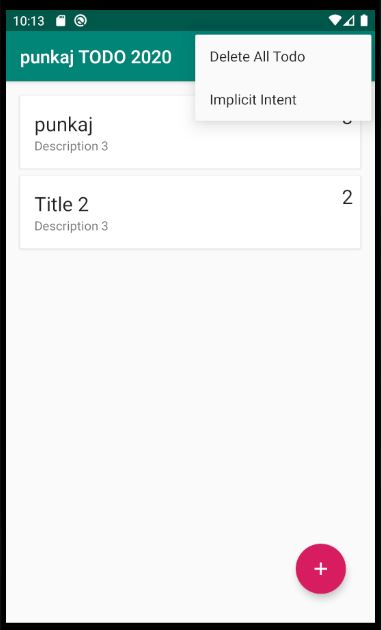

# TODO APP 2020
DMA Second Assessment

TO-DO APP

<h3>Introduction</h3>

This is a TODO-APP, a assessment of developing mobile application final assignment. I this app all the requirement given by university has been fulfilled as per the guide line of the univesity. Model-View_ViewModel(MVVM) the main role of mvvm in the software development process are View informs the inform the viewmodel 
about the users action. view model handles the connection between view and model it is also equivalent to the controller or mediator of between view and model
Data Model is the library of datasource. the view model works with data model for to get and set purpose. 

Above images are main activity images. While opening TODO-APP firstly app display this images. this images contain list of task and from plus sign button user can able to add task. user can also delete the task by swiping the listed task.

Above images display while user click Plus sign button from here user can add the attribute of task table.

Above images display while user can double click the task which means user can able to update the task information.

Above images display menu of app. menu contain delete all todo and implicit todo when user click to delete all todo tab all the todo task will be delete and Form implicit intent user can acess british council website.

